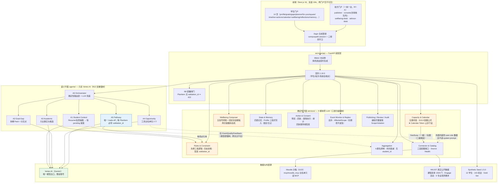
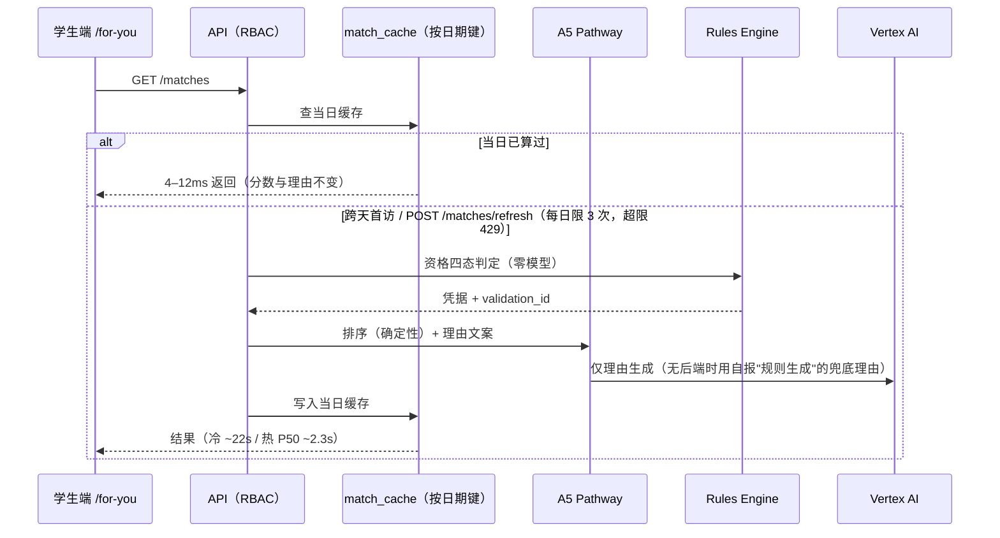
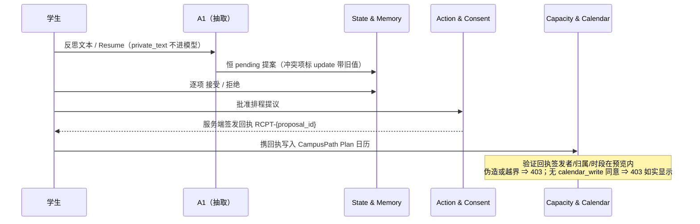

# CampusPath 架构文档

> 版本对应：Spec **v4.1.23** · Plan V2 · 契约 **1.34.0** · Seed **1.9.0**（2026-08-03 main 同步）
>
> 2026-08-04 北极星指标 VGA 落地（Spec v4.1.23，契约 1.34.0）：新增数据流
> **反思闭环 → VGA**——反思活动（OPP）→ 铸 EV-REFL 证据 + 同步铸
> `ActionEvent(verified_growth=True, evidence_ids=(EV,))`（幂等，契约校验器
> 强制挂证据）→ `GET /vga-summary` 纯派生逐月分桶（0 如实 200）→
> 成长动态跟踪页北极星卡（金黄星星+本月数+累计+逐月柱+行动清单）。
> 点击/收藏/报名事件 `verified_growth` 恒 false（§17.1「不奖励忙碌」）。
>
> 2026-08-03 自述学期撤除批（Spec v4.1.20，契约 1.33.0）：学生自述「我现在
> 大几」通道全删——契约层 `ProfileSelfEdit.current_term` / `StudentProfile.current_term`
> / CurrentTerm Literal 移除（extra=forbid 结构性拒收），目标工作室选择器与
> 选修课页学期下拉撤除；选修课学期视图改由教务侧派生（year × 教务码季别 →
> 如 Y2_FALL），「全部要求（按组）」常驻。学期/年级的唯一权威 = 教务侧
> （演示 = seed manifest + 校方 year；真实接入 = SIS）。
>
> 2026-08-03 双报障修复批（Spec v4.1.19）：**① A5 课程学期码单一权威源**——
> `CoursePlanItem.term` 一律取 seed manifest 教务码（`deps.current_term`，缺失按日期
> 推导）；`StudentProfile.current_term` 是 "y1s2" 年级码、同名不同义，误用曾致
> `GET /pathway` 500；`build_a5_pathway` 调用点补异常护栏（任何异常回落夹具并进
> 当日失败负缓存，读端点不许 500）。**② 近两周口径单一出处**——
> `apps/web/src/lib/plan-window.ts`（课外条目 + 最早活动锚点 + 14 天窗口 +
> storedIntensity 强度同源），行动中心与课外活动规划两页共用，不再各筛各的。
> **③ 前端会话缓存**——`useResource` 增 `cacheKey`（模块级 Map，
> stale-while-revalidate：命中即渲染、后台静默核新、错误不吞），For You 三资源接入。
>
> 2026-08-03 新增四条数据流：**① 口令门**（取代 Google 邮箱白名单：middleware 校验
> HMAC httpOnly cookie，口令只存 `CAMPUSPATH_DEMO_PASSCODE` 环境变量，`/api/auth/passcode`
> 服务端恒时比对签发；页面 HTML 统一 `no-store`——旧门的 307 曾遮蔽 Next 预渲染的
> s-maxage=1 年，撤门即白屏的教训）；**② Agent Runtime 状态灯**（顶栏绿灯=计费中：
> `GET /ops/agent-runtime` 脚本探测失败时走 Vertex REST 回退【容器 ADC 直查
> ReasoningEngine 列表】，缓存 stale-while-revalidate 单飞后台刷新）；**③ 三档强度**
> （`GET /pathway?intensity=` → A5 全量分档：课程 2/3/4 门、活动池 8/10/12、
> 近两周条目 ≤3/5/7、近两周预算 20/30/45h；trigger 指纹带档位）；**④「不参加」**
> （`DELETE /pathway/items/{id}`：版本剔除+DECLINE 审计事件+日历真实块收走+
> 拒绝名单防复活【A5 与演示夹具双路过滤】）。另：目标变更失效清单补全
> （research 按发起时目标名判 stale、set_goal 清 matches/选修当日缓存）；
> Resume 上传改模板确定性解析（`resume_template.py`，零模型，B3 提议流程不变）。
>
> 2026-08-02 审计修复批新增数据流：**Resume 模板解析链**（上传 → `resume_template.py`
> 确定性逐节解析【零模型】→ pending 提议 → 确认后物化：经历带真实 type、education/
> language/honor 入 extras、certificate 入 EvidenceRecord）；**A5 线上生成链**
> （GET /pathway → matches 六维分 + 记忆 advisory → `a5_pathway.build_a5_pathway`
> 【PathwayAgent 修复循环 + 课程三变体】→ trigger=a5:<目标指纹>，失败回落夹具）；
> **反思回流链**（匿名质量聚合 → 第六维；学生自己的 fit_tag → 个人偏好修正）；
> **日历写入恢复链**（已批准提案 ∩ 无 AB-plan 块 → 行动中心持久补写区）。
>
> 2026-08-02 验收反馈批新增数据流：**规划→日历投影**（calendar 页读 pathway 的机会类
> 条目 + catalog 起止时间 → 虚线「规划中」伪块，批准写入后由真实块取代）；**⚠️ 冲突
> 持久链**（schedule-proposal 服务端算冲突 → 非阻断可批准 → absorb 与 calendar 写入
> 都打 ⚠️ 前缀）；**SourcesSweepJob**（一键巡检后台线程，与逐源 refresh 共用
> `_do_refresh_source`）；**official_answers.json**（packs 内问答对照表，
> `match_official_answer` 确定性词面匹配 → 计划项 assumptions 带官方链接；
> 广场政策卡为二级回退）；**candidate_goal_share**（推荐配比：matches 前缀成比例
> 交织 + 选修加权与保底名额）。
>
> 2026-08-02 国际生链路修复批（审计 `docs/intl-chain-audit-2026-08-02.md` → 五处断链接通）：
> Pack 求值信封的两条**新消费流**——`/matches` 在评分后逐机会派生 `MatchResult.intl_notes`
> （机会三态字段 + 信封提前量对齐该机会开始日期，零 LLM）；`GET /pathway` 读时把信封的
> 准备动作/待补信息/约束派生为 `PlanItem(kind=action)`（凭据经 `issue_prep_item_validation`
> 由 Rules 真实签发、B8 主体对齐；**读时注入不落缓存**，与拆解列 `_augment_with_intl` 同模式）。
> 政策卡按 registry `policy_audience` 落 policy / intl_policy 双分类；运行时探测失败如实 `unknown`。
>
> 2026-08-02 新增三块（A/B/C 三提案）：
> **① 源采集回路**——`services/connector/` 增源注册表（92 源，84 真实/8 mock 以
> `is_real_fetch` 如实区分）+ 共享抓取器（stdlib，缓存+礼貌间隔）+ sha256 变更检测；
> `GET/POST /v1/ops/sources*` 端点；HKUST 官方域名白名单源变更条目经 A4 抽取后
> **直发 Published**（第三方投稿仍走人工审核），政策源变更产出 intl_policy 提醒卡；
> 每日巡检 `jobs/sources_refresh.py`（Cloud Run Job 形态 `infra/sources_job.sh`，并 main 后部署）。
> **② services/packs/**——vendored 国际生 Context Pack 求值器（零 LLM，llm-free 扫描
> 名单第 11 个成员）；`campuspath_rules.context_pack` 桥签发真 validation_id（B8 三层
> 查验成立，Pack 自铸 VAL-* 仅留痕）；档案页唯一勾选入口，A3 拆解/For You/行动中心
> 按 profile 全局读取。**③ 岗位画像数据层**——`agents/campuspath_agents/pack_data/`
> （employment_roles.json + evidence_catalog.json，由 `seed/compile_employment_pack.py`
> 从 JD 语料确定性编译，单一出处）；A3 按 target_name 关键词命中画像（零模型）；
> 未命中走「现场 AI 拆解」服务端后台任务（三段式确定性进度，产出 origin=ai_live
> 类型层区分，每日限 2 次）。
>
> UI 设计系统 v2（Claymorphism × Claude 暖色）：令牌与门禁见
> `docs/CampusPath_Design_Tokens_v2.0_Clay_2026-08-01.md`；Advisor 预约一小时时段制 + 注册 CRUD（B9）；已发布机会的管理端生命周期端点 PUT/DELETE /v1/catalog/opportunities/{id}（B10：编辑/下架，下架幂等留档）；投稿人状态自查 GET /v1/publisher/submissions（B13：退回修改对投稿人可见、同 id 重投）。
>
> 心理干预三层机制（R8-3，全链零 LLM）：触发（14 天警告 / 28 天·自报疲惫·超载+拒延≥5 → ISI+PSS-10）
> → 第一层自动联系自填 tutor（量表提交即知情动作）→ 第二层咨询室预约（时段唯一来源 =
> wellbeing-desk 设置的工作时段，预约带姓名/专业/年级/班级/联系方式，专业年级服务端回填）
> → 第三层紧急红按钮（每学期 2 次，第 3 次停用一学期，停用响应仍附热线）。
>
> 本文回答"系统由什么组成、请求怎么流、边界卡在哪"。产品定义以
> `CampusPath_Complete_Product_Spec_V4.1_2026-07-28.md` 为准；本文与代码不一致时以代码为准并须回改本文。
> **维护规则**：任何功能/架构改动落地后，本文相关小节与图必须同步更新（见 CLAUDE.md「文档维护」）。

---

## 1. 一句话架构

**双平面 + 契约先行**：6 个语义 Agent（A0–A5，唯一允许调模型的层，只走 Vertex AI）
与 9 个确定性服务（零 LLM，规则与阈值）各司其职；两平面之间的每一次数据交换都由
`contracts/` 里的 Pydantic 模型定形——**类型不允许的数据，物理上流不过去**。

- 判定（资格、容量、健康信号）→ 确定性服务，可复现、可审计；
- 语义（理由文案、抽取、排序解释、trade-off）→ Agent，且 **A5 是唯一做 trade-off 的**；
- 前端拆两个门户（学生 / 校方），服务端 RBAC 的角色表直接从契约生成。

## 2. 系统架构总图

橙色 = 架构六条里"零 LLM"红线的三个实体模块；蓝色 = 唯一 trade-off Agent；
虚线 = 被类型层强制收窄的数据通道。

## 3. 关键请求流

### 3.1 推荐（For You，F11）——每日一次 AI + 限次刷新

### 3.2 从建议到写日历（F06/F16）——同意链

## 4. 架构六条 → 技术落点

| # | 红线（Spec §8.9） | 强制机制（代码位置） |
|---|---|---|
| 1 | A5 是唯一 trade-off Agent | `agents/campuspath_agents/roster.py`：A1–A4 输出类型无排序字段；评测 B 项断言 |
| 2 | Wellbeing 全链零 LLM | `services/wellbeing/`：阈值判定 + 六槽位双语模板；三层零 LLM 扫描（运行时 sys.modules / 依赖树 / 源码 import） |
| 3 | Calendar Token 不进 LLM 上下文 | Token 止步 `services/capacity/`；两级授权放行的是标题**文本**非凭据，`AvailabilityBlock._title_requires_grant` 类型层强制（B5） |
| 4 | A4 工具白名单只有 2 个 | `agents/campuspath_agents/tools.py` ToolBelt 双重强制；外部内容走 `ModelRequest` 的 data 字段，与 system 物理分离 |
| 5 | PlanItem 必带 validation_id | Rules 签发（形状 + Registry 两层查验）；API B8 闸门缺失即 422 |
| 6 | A1 → Aggregation 只传结构化反馈 | `EventQualityFeedback` 无 student_id 字段；Aggregation 公开函数签名不含 student_id（结构性断言） |

## 5. 分层清单

### 契约层（`contracts/`，唯一真相来源）
声明式 OpenAPI（`openapi.py`，不从 FastAPI 反推）。**129 个 Pydantic 模型 / 59 路径 66 操作 / 185 OpenAPI schema**，
版本 1.13.0（1.3 同意自助授权 → 1.10 档案自助编辑 → 1.11 证据上传 → 1.12 重要联系人 → 1.13 ISI/PSS-10 评估 → 1.14 校方复合角色 → 1.15 档案补充分区）。改动三件套：`openapi.py` 声明 → `make contracts && make types` → API 实现。
前端 TS 类型同源生成，`make contracts-check` 守产物一致性。

### 确定性平面（`services/`，9 模块 + 2 装配）
上图 9 模块各自独立成包、独立测试、各过三层零 LLM 扫描（`make llm-free`）。
另有 `services/api/`（FastAPI 装配 + RBAC + B8 闸门）与 `services/mock-campus/`（SIS/Degree Audit 等 7 个 mock 端点）。

### 语义平面（`agents/`）
| Agent | 类 | 职责 |
|---|---|---|
| A0 | `OrchestratorAgent` | 两段式路由：确定性路由表 + LLM 编排兜底 |
| A1 | `StudentContextAgent` | Resume/反思抽取；产出恒为 pending 提案；私有原文不进模型 |
| A2 | `AcademicAgent` | 学业事实与候选（不排序）；Moodle 适配器挂入工具带在 backlog |
| A3 | `GoalGapAgent` | 目标拆解（`GOAL_DECOMPOSITION_PACKS` 三人群 Pack：求职/创业/读研）+ 双目标分叉点 |
| A4 | `OpportunityAgent` | 不可信外部内容标准化，白名单 `read_source` + `emit_opportunity_draft` |
| A5 | `PathwayAgent` | 唯一 trade-off：排序、Plan A/B/C、约束修复循环、low-load 试算 |

模型访问统一走 `vertex.py`（ADC，`assert_vertex_only()` 运行时自检 + 静态扫描双保险）。
测试用 `ScriptedModel`（未预设 purpose 抛异常）——Agent 正确性不依赖能否调通模型。

**上线深度（R7-D，2026-08-01 起六个类全部在线）**：A1（Resume/反思）、A3（拆解/分叉）、
A2（候选构建 `_course_candidates_for`）、A0（/matches 与选修推荐的确定性路由，
痕迹见 `GET /v1/students/{id}/agent-trace`）、A4（`POST /v1/ops/sources/ingest` 摄入链，
原文只作数据块）；A5 职责（唯一排序者）在 /matches 成立。

**云端部署形态（ADK → Vertex AI Agent Engine，us-central1）**：两个运行时
`agents/cloud/orchestrator_agent`（A0 镜像，路由表与 roster 逐项一致由
`test_cloud_mirror.py` 强制）与 `agents/cloud/opportunity_scout_agent`（A4 镜像，
工具签名无发布通道）。管理入口 `bash infra/agent_engine.sh status|query|delete`——
运行时按小时计费，**演示完必须 delete**。

### 数据层（`seed/` + `mcp/`）
- **真实公开数据**：HKUST 课程目录（58 学科 1534 门，先修表达式原文保留）、Engage 活动 66 条、5 专业培养要求（`seed/raw/hkust_programs/programs.json`，37 组）；
- **合成数据**（Seed 1.5.0，字节级可复现）：12 学生（3 深度 Persona）、143 机会（八大主办方类）、Gold Set 四态各 15、16 类失败样本；页面标注 Synthetic / Demo Data；
- **Moodle 沙箱**：GCE `campuspath-moodle`（asia-east2-a，夜间 23:00–09:00 HKT 停机），`mcp/moodle_mcp/` = wsfunction 白名单只读客户端 + stdio JSON-RPC MCP 服务器 + 契约映射适配器；token 只在 Secret Manager。

### 前端（`apps/web/`，Next.js 16 + bun）
两门户共用一个 app，由 `providers.tsx` 的会话模型与 `nav.ts` 的门户过滤 + 三规则守卫隔离
（未登录→/login；跨门户→弹回本门户首页；已登录访问 login→弹回）。真正的权限边界在服务端 RBAC。
文案全部走 `src/i18n/`（en.ts 为类型源），简/繁/英三语可切换持久化——
繁体词典由 OpenCC 自简体生成入库（`i18n:hant` + `i18n:hant:check` 守一致性），
契约 `LocalizedText` 不加字段：繁体态下服务端动态文案运行时确定性转换。

### 评测（`eval/`，`make eval`）
13 BLOCKER（红线，违反即失败）· 12 TARGET（量化指标，当前 11/12，T11 75% 如实红）·
5 BASELINE（对照基线，全确定性）。判定类指标要求双跑逐字节一致；Gold Label 与引擎故意分开实现。

## 6. 横切机制

- **门禁链**：`scripts/preflight.sh`（14 项，含计费账号=赠金账号断言）→ pre-commit 密钥/AI-Studio 拦截 → `make check`（preflight + 契约/Seed 一致性 + 全量测试 + llm-free + harness 自检）。
- **Harness Engineering**：检查器必须用已知会失败的样例证明它真的会失败（H5）；报实测值不报预期值。踩坑台账唯一出处 Plan §10.2。
- **上下文交接**：`.claude/hooks/handoff.py`（70% 提醒 / 80% 自动压缩 / 压缩后自动注入 `HANDOFF.md`）。

## 7. 文档地图

| 文档 | 角色 |
|---|---|
| `CampusPath_Complete_Product_Spec_V4.1_2026-07-28.md` | 产品基线（现 v4.1.7，功能 F01–F27 零删减） |
| `CampusPath_Implementation_Plan_V2.md` | 执行计划：D1–D7 验收、WP0–WP11、踩坑台账 §10.2 |
| **本文** | 架构：组成、数据流、边界落点（随实现同步更新） |
| `README.md` | 入口：项目简介 + 文件结构 + 开工命令 |
| `PROGRESS.md` | 进度审计：只记已验证事实，附验证方式与 commit |
| `docs/demo-runbook.md` | Spec §19 十七步演示对照与彩排清单 |
| `contracts/README.md` / `seed/DATA_DICTIONARY.md` / `infra/README.md` | 各层细则 |
